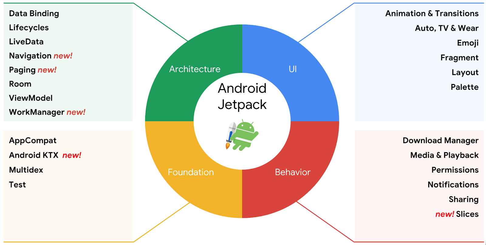

Android ARCH Kotlin
=================
A single screen app illustrating Android development with Android Jetpack.

This is a template project designed to give you a quick start to your projects.

Introduction
------------
Android Jetpack is a set of components, tools and guidance to make great Android apps. They bring together the existing Support Library and Architecture Components and arrange them into four categories:

To start, consider the following diagram, which shows how all the modules should interact with one another after designing the app:

Notice that each component depends only on the component one level below it. For example, activities and fragments depend only on a view model. The repository is the only class that depends on multiple other classes; in this example, the repository depends on a persistent data model and a remote backend data source.

This design creates a consistent and pleasant user experience. Regardless of whether the user comes back to the app several minutes after they've last closed it or several days later, they instantly see a user's information that the app persists locally. If this data is stale, the app's repository module starts updating the data in the background.

Android Studio IDE setup
------------------------
For development, the latest version of Android Studio is required. The latest version can be downloaded from [here](https://developer.android.com/studio/).

Android ARCH Kotlin uses [ktlint](https://ktlint.github.io/) to enforce Kotlin coding styles. Here's how to configure it for use with Android Studio (instructions adapted from the ktlint [README](https://github.com/shyiko/ktlint/blob/master/README.md)):

- Close Android Studio if it's open

- Download ktlint using these [installation instructions](https://github.com/pinterest/ktlint/blob/master/README.md#installation)

- Apply ktlint settings to Android Studio using these [instructions](https://github.com/pinterest/ktlint/blob/master/README.md#-with-intellij-idea)

- Start Android Studio

Getting Started
---------------
This project uses the Gradle build system. To build this project, use the `gradlew build` command or use "Import Project" in Android Studio.

Usage
------------------------
* Clone this repository or download the zip folder of this project to your projects folder.
* After extract the zip, follow [these instructions](https://stackoverflow.com/questions/1213430/how-to-fully-delete-a-git-repository-created-with-init) to delete the current git control version, then you can create your own.

* Rename the project to whatever you want by doing these follow steps:
    * Rename your project folder
    * Under the folders app > src > "androidTest", "main", and "test" rename or delete the folders "com", "example", "android" and "androidarchkotlin" to match with your package name
    * On android manifest rename the package name
    * On your gradle module file rename the applicationId
    * On string resources xml file rename the **app_name** string
    * Rename the database name on **DatabaseModule** class.

* You're good to go!

Libraries used
------------------------
* [Foundation][0] - Components for core system capabilities, Kotlin extensions and support for
  multidex and automated testing.
  * [Android KTX][1] - Write more concise, idiomatic Kotlin code.
  * [Test][2] - An Android testing framework for unit and runtime UI tests.
* [Architecture][3] - A collection of libraries that help you design robust, testable, and
  maintainable apps. Start with classes for managing your UI component lifecycle and handling data
  persistence.
  * [View Binding][4] - View binding is a feature that allows you to more easily write code that interacts with views.
  * [Lifecycles][5] - Create a UI that automatically responds to lifecycle events.
  * [LiveData][6] - Build data objects that notify views when the underlying database changes.
  * [Navigation][7] - Handle everything needed for in-app navigation.
  * [Room][8] - Access your app's SQLite database with in-app objects and compile-time checks.
  * [ViewModel][9] - Store UI-related data that isn't destroyed on app rotations. Easily schedule
     asynchronous tasks for optimal execution.
* [UI][10] - Details on why and how to use UI Components in your apps - together or separate
  * [Fragment][11] - A basic unit of composable UI.
  * [Layout][12] - Lay out widgets using different algorithms.
* Third party
  * [Glide][13] for image loading
  * [Kotlin Coroutines][14] for managing background threads with simplified code and reducing needs for callbacks
  * [Dagger][15] Dagger is a fully static, compile-time dependency injection framework for both Java and Android. It is developed by the Java Core Libraries Team at Google.
  * [Gson][16] Gson is an open-source Java library to serialize and deserialize Java objects to JSON.
  * [Logging Interceptor][17] An OkHttp interceptor which logs HTTP request and response data.
  * [Retrofit][18] A type-safe HTTP client for Android and Java.

[0]: https://developer.android.com/jetpack/components
[1]: https://developer.android.com/kotlin/ktx
[2]: https://developer.android.com/training/testing/
[3]: https://developer.android.com/jetpack/arch/
[4]: https://developer.android.com/topic/libraries/view-binding
[5]: https://developer.android.com/topic/libraries/architecture/lifecycle
[6]: https://developer.android.com/topic/libraries/architecture/livedata
[7]: https://developer.android.com/topic/libraries/architecture/navigation/
[8]: https://developer.android.com/topic/libraries/architecture/room
[9]: https://developer.android.com/topic/libraries/architecture/viewmodel
[10]: https://developer.android.com/guide/topics/ui
[11]: https://developer.android.com/guide/components/fragments
[12]: https://developer.android.com/guide/topics/ui/declaring-layout
[13]: https://bumptech.github.io/glide/
[14]: https://kotlinlang.org/docs/reference/coroutines-overview.html
[15]: https://github.com/google/dagger
[16]: https://github.com/google/gson
[17]: https://github.com/square/okhttp/tree/master/okhttp-logging-interceptor
[18]: https://github.com/square/retrofit

Upcoming features
-----------------
Updates will include incorporating additional Jetpack components and updating existing components as the component libraries evolve.

Interested in seeing a particular feature of the Android Framework or Jetpack implemented in this app? Please open a new [issue](https://github.com/lucasgomes-eti/androidarch.kotlin/issues) and if possible create a pull request.

Non-Goals
---------
The focus of this project is on Android Jetpack and the Android framework.
Thus, there are no immediate plans to implement features outside of this scope.

Third Party Content
-------------------
To illustrate a network request this get app uses the [Madam Nazar Location API](https://documenter.getpostman.com/view/6602370/SVtN3rnY?version=latest)

License
-------
Copyright 2018 Lucas Gomes.

Licensed to the Apache Software Foundation (ASF) under one or more contributor
license agreements.  See the NOTICE file distributed with this work for
additional information regarding copyright ownership.  The ASF licenses this
file to you under the Apache License, Version 2.0 (the "License"); you may not
use this file except in compliance with the License.  You may obtain a copy of
the License at

  http://www.apache.org/licenses/LICENSE-2.0

Unless required by applicable law or agreed to in writing, software
distributed under the License is distributed on an "AS IS" BASIS, WITHOUT
WARRANTIES OR CONDITIONS OF ANY KIND, either express or implied.  See the
License for the specific language governing permissions and limitations under
the License.